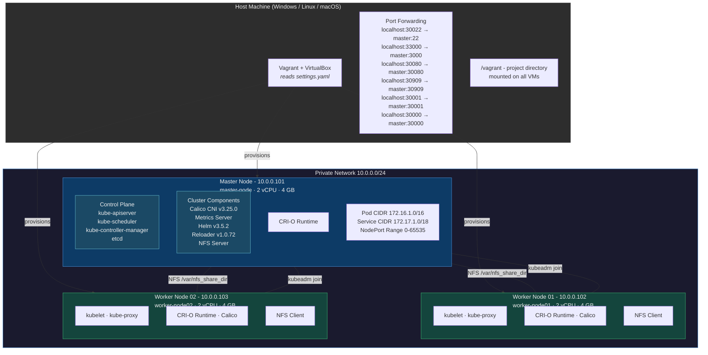
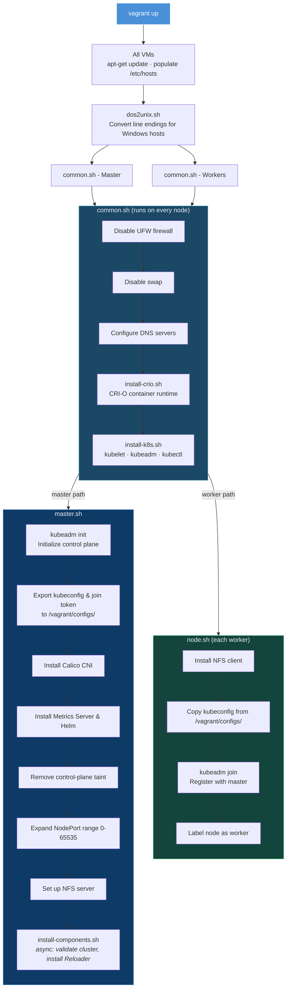

# Kubernetes Cluster with Vagrant

A fully automated local Kubernetes cluster provisioned with Vagrant and VirtualBox. Spins up a multi-node cluster (1 master + N workers) on Ubuntu 22.04 with CRI-O, Calico networking, Helm, NFS storage, and more. Ready to use in a single `vagrant up`.

## Architecture Diagram



## Provisioning Flow



## Prerequisites

- **VirtualBox** v7.0.6 or later
- **Vagrant** v2.4.0 or later
- **RAM**: 16 GB+ on the host (each VM uses ~4 GB)

## Setup

### 1. Clone the repository

```shell
git clone https://github.com/CodeMaster10000/k8s-cluster-vagrant.git
cd k8s-cluster-vagrant
```

### 2. Configure Vagrant home (optional)

Set the `VAGRANT_HOME` environment variable if you want Vagrant data stored in a custom location.

### 3. Download the base box

The Vagrant box (~1 GB) is hosted externally since it exceeds version control limits.

1. Navigate to `boxes/vbox-ubuntu/`
2. Download from: [Google Drive](https://drive.google.com/file/d/1scqAQ1FMp81kbWM_Y-8fxarW-1i1Xvj5/view?usp=sharing)
3. Ensure the file is at `boxes/vbox-ubuntu/bento-ubuntu-22-04.box`

### 4. Bring up the cluster

```shell
vagrant up
```

This provisions the master node first, then all worker nodes. The entire process takes several minutes depending on your hardware and network speed.

## Usage

### Access the cluster

**Option A - SSH via Vagrant:**
```shell
vagrant ssh master
kubectl get nodes
```

**Option B - SSH via PuTTY or any SSH client:**
- IP: `10.0.0.101`
- User: `root`
- Password: `vagrant`

### Verify the cluster

```shell
kubectl get nodes
kubectl get pods --all-namespaces
```

### Suspend the cluster (recommended over halt)

```shell
vagrant suspend
```

### Resume the cluster

```shell
vagrant up
```

### Destroy the cluster

```shell
vagrant destroy -f
```

## Restarting After a Host Reboot

When restarting VMs after the host machine has been rebooted:

1. Start the master first: `vagrant up master`
2. Wait ~5 minutes for the Kubernetes control plane to stabilize
3. Start the workers: `vagrant up`

If pods are not scheduling after a restart, try restarting the Calico pods:

```shell
kubectl delete pod -n kube-system -l k8s-app=calico-node
kubectl delete pod -n kube-system -l k8s-app=calico-kube-controllers
```

## Configuration

All cluster settings are centralized in **`settings.yaml`**:

| Setting | Default | Description |
|---|---|---|
| `nodes.workers.count` | `2` | Number of worker nodes |
| `nodes.*.cpu` | `2` | vCPUs per node |
| `nodes.*.memory` | `4144` | RAM (MB) per node |
| `network.control_ip` | `10.0.0.101` | Master node IP (workers increment from here) |
| `network.pod_cidr` | `172.16.1.0/16` | Pod network CIDR |
| `network.service_cidr` | `172.17.1.0/18` | Service network CIDR |
| `software.kubernetes` | `v1.29` | Kubernetes version |
| `software.crio` | `1.28` | CRI-O version |

## Project Structure

```
.
├── Vagrantfile                      # VM definitions and provisioning orchestration
├── settings.yaml                    # Cluster configuration (nodes, network, versions)
├── environment.properties           # Shared variables and console colors for scripts
├── dos2unix.sh                      # Line-ending conversion for Windows compatibility
├── boxes/vbox-ubuntu/               # Vagrant base box and SSH private key
├── configs/                         # Generated at runtime (kubeconfig, join token)
├── provision/
│   ├── k8s/
│   │   ├── common/
│   │   │   ├── common.sh            # Shared setup (firewall, swap, DNS)
│   │   │   ├── install-crio.sh      # CRI-O container runtime installation
│   │   │   └── install-k8s.sh       # kubelet, kubeadm, kubectl installation
│   │   ├── master/
│   │   │   ├── master_vm_provision.sh  # Master VM entry point
│   │   │   └── master.sh              # Control plane init, CNI, Helm, NFS
│   │   ├── node/
│   │   │   ├── node_vm_provision.sh    # Worker VM entry point
│   │   │   └── node.sh                # Cluster join and node labeling
│   │   └── components/
│   │       ├── install-components.sh   # Async component installer
│   │       └── reloader/reloader.yaml  # Reloader deployment manifest
│   └── config/
│       ├── error_handling.sh         # Shared error trap
│       ├── cluster-validation.sh     # Waits for kube-system pods to be ready
│       └── nfs/exports               # NFS export configuration
└── etc/useful-commands.txt           # Handy kubectl, helm, and CRI-O commands
```

## License

MIT License - see [LICENSE.txt](LICENSE.txt).
